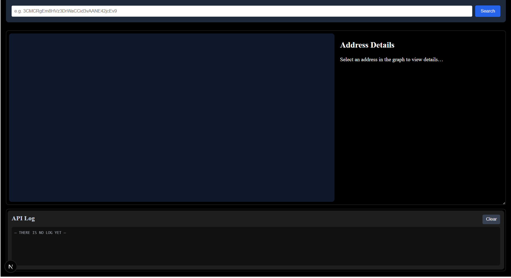
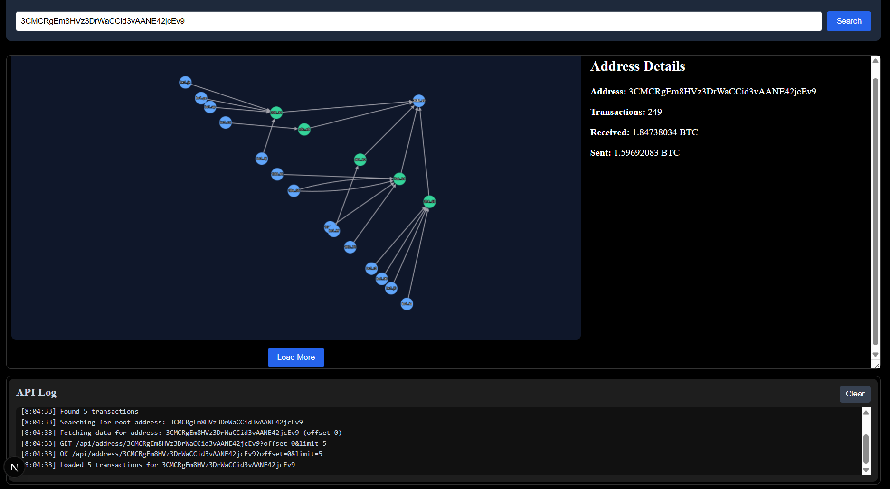
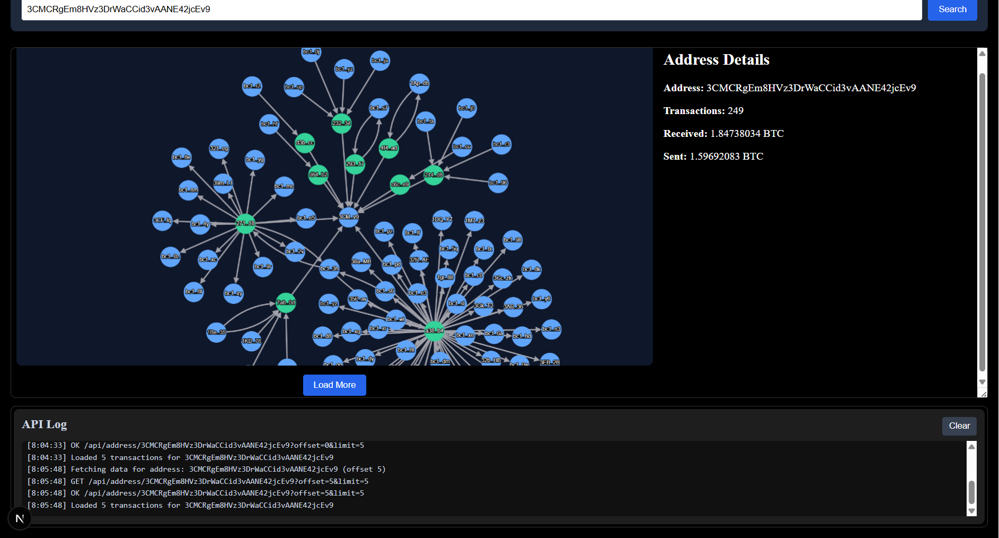
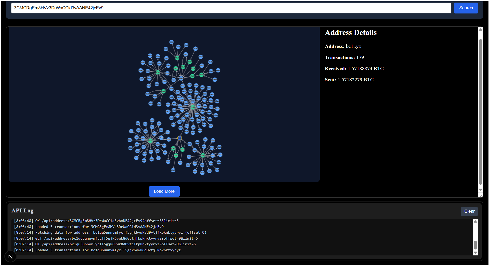

# Leadspotting Blockchain Investigator

A visual blockchain investigation tool that allows users to **track Bitcoin transactions** across wallet addresses
through an interactive graph.
Built as part of the Leadspotting Full-Stack assignment using **Next.js, TypeScript, and Cytoscape.js**.

---

## 🚀 Features

- 🔍 **Search any Bitcoin address** - Fetch and display all transactions related to the entered wallet address.
- 🕸️ **Interactive Graph View** - Visualize connections between addresses and transactions using Cytoscape.js.
- ➕ **Expandable Nodes** - Click any address node to load more transactions dynamically.
- 💾 **Smart Caching** - Reduces redundant API calls and speeds up repeated searches.
- ⚡ **Live Log Panel** - Displays API requests and responses in real time.
- 🎨 **Clean, modern UI** - Designed for clarity and performance with React and Next.js.

---

## 🧩 Tech Stack

| Area                | Technology                                                 |
|---------------------|------------------------------------------------------------|
| Frontend            | Next.js (TypeScript), React                                |
| Graph Visualization | Cytoscape.js + Cose-Bilkent layout                         |
| State Management    | Zustand                                                    |
| API Layer           | Custom `/api/address/[address]/route.ts` using Bitcoin API |
| Logging             | Client-side log system integrated with Zustand store       |
| Styling             | TailwindCSS + custom CSS modules                           |

---

## 📂 Folder Structure

src/
├─ app/
│ ├─ api/address/[address]/route.ts → Bitcoin address API endpoint
│ ├─ globals.css → Global styles
│ ├─ page.tsx → Main app page
│ └─ layout.tsx → App shell
├─ components/
│ ├─ SearchAddress.tsx → Bitcoin address search bar
│ ├─ GraphView.tsx → Cytoscape-based graph visualization
│ ├─ AddressDetails.tsx → Transaction and balance info panel
│ ├─ LogPanel.tsx → Real-time API log panel
│ ├─ LoadingSpinner.tsx → Loading indicator
│ └─ ErrorBoundary.tsx → Error handling component
└─ lib/
├─ api.ts → Fetch and request logic
├─ store.ts → Zustand global state management
└─ constants.ts → Shared constants (LIMIT, OFFSET, etc.)

---

## ⚙️ Installation & Run

To run the project locally:

```bash
# 1 Install dependencies
pnpm install

# 2 Start the development server
pnpm run dev

# 3 Open in your browser
http://localhost:3000

---

## Example Screenshots

The following images show the application workflow - from searching a Bitcoin address to exploring dynamic transaction graphs.

### Initial State
The app before any search - clean UI waiting for input.


### Address Search
User enters a Bitcoin address and triggers the search.


### Graph Interaction
Nodes are draggable and dynamically repositioned.


### Load More Transactions
Each click expands the graph with additional related addresses.


### Node Selection
Selecting a node updates the Address Details panel dynamically.


---

## Developer Notes

This project was built with a focus on clean architecture, modularity, and real-time visualization performance.
The main goal was to design an intuitive and interactive blockchain investigation tool that scales visually as data grows.

### Technical Highlights
- **Next.js + TypeScript** for robust, type-safe frontend development.
- **Zustand** for lightweight and predictable global state management.
- **Cytoscape.js** for dynamic graph visualization and real-time node interaction.
- **Blockchain.info API** integration for fetching live Bitcoin transaction data.
- **Incremental loading (limit + offset)** mechanism for performance optimization.
- **Commitlint + Husky** for maintaining consistent and readable commit history.

---

## Future Improvements

- **Backend Expansion**: Add a small Node.js or Spring Boot service to handle caching and API rate limiting.
- **Graph Analytics**: Implement address clustering and suspicious-pattern detection.
- **UX Enhancements**: Add hover tooltips, transaction summaries, and dark/light theme toggle.
- **Pagination & Filtering**: Support advanced navigation and filtering of transaction lists.
- **Export Feature**: Allow exporting the graph and related data as PDF or JSON for investigation reports.
- **Testing**: Add unit and integration tests with Jest or Playwright.

---

